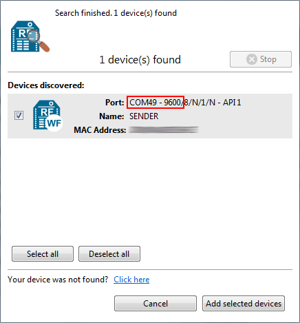

Frequently Asked Questions (FAQs)
=================================

The FAQ section contains answers to general questions related to the XBee
Python Library.

What is XCTU and how do I download it?
--------------------------------------

XCTU is a free multi-platform application designed to enable developers to
interact with Digi RF modules through a simple-to-use graphical interface. You
can download it at `www.digi.com/xctu <http://www.digi.com/xctu>`_.

How do I find the serial port and baud rate of my module?
---------------------------------------------------------

Open the XCTU application, and click the **Discover radio modules connected to your
machine** button.

Select all ports to be scanned, click **Next** and then **Finish**. Once the
discovery process has finished, a new window notifies you how many devices have
been found and their details. The serial port and the baud rate are shown in
the **Port** label.

.. note::
   Note In UNIX systems, the complete name of the serial port contains the
   **/dev/ prefix**.

Can I use the XBee Python Library with modules in AT operating mode?
--------------------------------------------------------------------

No, the XBee Python Library only supports **API** and **API Escaped** operating
modes.

I get the Python error ``ImportError: No module named 'serial'``
----------------------------------------------------------------

This error means that Python cannot find the ``serial`` module, which is used by
the library for the serial communication with the XBee devices.

You can install PySerial running this command in your terminal application:

.. code::

  $ pip install pyserial

For further information about the installation of PySerial, refer to the
`PySerial installation guide
<http://pythonhosted.org/pyserial/pyserial.html#installation>`_.

I get the Python error ``ImportError: No module named 'srp'``
-------------------------------------------------------------

This error means that Python cannot find the ``srp`` module, which is used by
the library to authenticate with XBee devices over Bluetooth Low Energy.

You can install SRP running this command in your terminal application:

.. code::

  $ pip install srp
