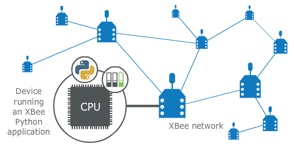

XBee Python Library
===================

Release v\ |version|. (:ref:`Installation <gsgInstall>`)

.. image:: https://pepy.tech/badge/digi-xbee
    :target: https://pepy.tech/project/digi-xbee
.. image:: https://badge.fury.io/py/digi-xbee.svg
    :target: https://pypi.org/project/digi-xbee/
.. image:: https://img.shields.io/pypi/pyversions/digi-xbee.svg
    :alt: PyPI - Python Version
    :target: https://pypi.org/project/digi-xbee/

XBee devices allow you to enable wireless connectivity to your projects creating
a network of connected devices. They provide features to exchange data with
other devices in the network, configure them and control their I/O lines. An
application running in an intelligent device can take advantage of these
features to monitor and manage the entire network.

Despite the available documentation and configuration tools for working with
XBee devices, it is not always easy to develop these kinds of applications.

The XBee Python Library is a Python API that dramatically reduces the time to
market of XBee projects developed in Python and facilitates the development of
these types of applications, making it an easy and smooth process. The XBee
Python Library includes the following features:

* Support for multiple XBee devices and protocols.
* High abstraction layer provides an easy-to-use workflow.
* Ability to configure local and remote XBee devices of the network.
* Discovery feature finds remote nodes on the same network as the local module.
* Ability to transmit and receive data from any XBee device on the network.
* Ability to manage the General Purpose Input and Output lines of all your XBee
  devices.
* Ability to send and receive data from other XBee interfaces (Serial,
  Bluetooth Low Energy and MicroPython).

This portal provides the following documentation to help you with the different
development stages of your Python applications using the XBee Python Library.

Requirements
============

The XBee Python library requires the following components in order to work
properly:

* **Python 3**. You can get it from https://www.python.org/getit/
* **PySerial 3**. Install it with pip (``pip install pyserial``) or refer to
  the `PySerial installation guide
  <http://pythonhosted.org/pyserial/pyserial.html#installation>`_ for further
  information about getting PySerial.
* **SRP**  Install it with pip (``pip install srp``).

Contents
========

The XBee Python library documentation is split in different sections:

* :ref:`indexGSG`
* :ref:`indexUserDoc`
* :ref:`indexExamples`
* :ref:`indexFAQ`
* :ref:`indexChangeLog`
* :ref:`indexAPI`

.. _indexGSG:

Getting Started
---------------

Perform your first steps with the XBee Python library. Learn how to setup your
environment and communicate with your XBee devices using the library.

* :doc:`getting_started_with_xbee_python_library`

.. _indexUserDoc:

User Documentation
------------------

Access detailed information about the different features and capabilities
provided by the library and how to use them.

* :doc:`user_doc/xbee_terminology`
* :doc:`user_doc/working_with_xbee_classes`
* :doc:`user_doc/configuring_the_xbee_device`
* :doc:`user_doc/discovering_the_xbee_network`
* :doc:`user_doc/communicating_with_xbee_devices`
* :doc:`user_doc/handling_analog_and_digital_io_lines`
* :doc:`user_doc/update_the_xbee`
* :doc:`user_doc/logging_events`

.. _indexExamples:

Examples
--------

The library includes a good amount of examples that demonstrate most of the
functionality that it provides.

* :doc:`examples`

.. _indexFAQ:

FAQ
---

Find the answer to the most common questions or problems related to the XBee
Python library in the FAQ section.

* :doc:`faq`

.. _indexChangeLog:

Changelog
----------

* :doc:`changelog`

.. _indexAPI:

API reference
-------------

The API reference contains more detailed documentation about the API for
developers who are interested in using and extending the library functionality.

* :doc:`api/modules`

.. toctree::
   :maxdepth: 4
   :hidden:
   :caption: Getting Started

   getting_started_with_xbee_python_library

.. toctree::
   :maxdepth: 4
   :hidden:
   :caption: User Documentation

   user_doc/xbee_terminology
   user_doc/working_with_xbee_classes
   user_doc/configuring_the_xbee_device
   user_doc/discovering_the_xbee_network
   user_doc/communicating_with_xbee_devices
   user_doc/handling_analog_and_digital_io_lines
   user_doc/update_the_xbee
   user_doc/logging_events

.. toctree::
   :maxdepth: 4
   :hidden:
   :caption: Examples

   examples

.. toctree::
   :maxdepth: 4
   :hidden:
   :caption: FAQs

   faq

.. toctree::
   :maxdepth: 4
   :hidden:
   :caption: Changelog

   changelog

.. toctree::
   :maxdepth: 4
   :hidden:
   :caption: API reference

   api/modules

Indices and tables
==================

* :ref:`genindex`
* :ref:`modindex`
* :ref:`search`

License
=======

Copyright 2017-2021, Digi International Inc.

This Source Code Form is subject to the terms of the Mozilla Public
License, v. 2.0. If a copy of the MPL was not distributed with this
file, you can obtain one at http://mozilla.org/MPL/2.0/.

THE SOFTWARE IS PROVIDED "AS IS" AND THE AUTHOR DISCLAIMS ALL WARRANTIES
WITH REGARD TO THIS SOFTWARE INCLUDING ALL IMPLIED WARRANTIES OF
MERCHANTABILITY AND FITNESS. IN NO EVENT SHALL THE AUTHOR BE LIABLE FOR
ANY SPECIAL, DIRECT, INDIRECT, OR CONSEQUENTIAL DAMAGES OR ANY DAMAGES
WHATSOEVER RESULTING FROM LOSS OF USE, DATA OR PROFITS, WHETHER IN AN
ACTION OF CONTRACT, NEGLIGENCE OR OTHER TORTIOUS ACTION, ARISING OUT OF
OR IN CONNECTION WITH THE USE OR PERFORMANCE OF THIS SOFTWARE.

Digi International Inc. 11001 Bren Road East, Minnetonka, MN 55343
