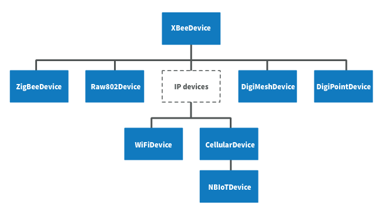

Work with XBee classes
======================

When working with the XBee Python Library, start with an XBee object that
represents a physical module. A physical XBee is the combination of hardware and
firmware. Depending on that combination, the device runs a specific wireless
communication protocol such as Zigbee, 802.15.4, DigiMesh, Wi-Fi, or Cellular.
An ``XBeeDevice`` class represents the XBee module in the API.

These protocols share some features and settings, but there are some differences
between them. For that reason, the XBee Python Library also includes a set of
classes to represent XBee devices running different communication protocols.
The XBee Python Library supports one XBee class per protocol, as follows:



* XBee Zigbee (``ZigBeeDevice``)
* XBee 802.15.4 (``Raw802Device``)
* XBee DigiMesh (``DigiMeshDevice``)
* XBee Point-to-multipoint (``DigiPointDevice``)
* XBee IP devices (This is a non-instantiable class)

  * XBee Cellular (``CellularDevice``)
  * XBee Wi-Fi (``WiFiDevice``)

All these XBee classes allow you to configure the physical XBee, communicate
with the device, send data to other nodes on the network, receive data from
remote devices, and so on. Depending on the class, you may have additional
methods to execute protocol-specific features or similar methods.

To work with the API and perform actions involving the physical device,
instantiate a generic ``XBeeDevice`` object or one that is protocol-specific.

.. note::
  This documentation refers to the ``XBeeDevice`` object when describing the
  different features, but they are also applicable to any XBee
  protocol-specific class.


Instantiate an XBee object
--------------------------

When you are working with the XBee Python Library, the first step is to
instantiate an XBee object. The API works well using the generic ``XBeeDevice``
class, but you can also instantiate a protocol-specific XBee object if you know
the protocol your physical XBee is running.

An XBee is represented as either **local** or **remote** in the XBee Python
Library, depending upon how you communicate with the device.


Local XBee node
```````````````

A local XBee is the object representing the device physically attached to your
PC through a serial or USB port. The classes you can instantiate to represent a
local device are listed in the following table:

+-----------------+--------------------------------------+
| Class           | Description                          |
+=================+======================================+
| XBeeDevice      | Generic object, protocol-independent |
+-----------------+--------------------------------------+
| ZigBeeDevice    | Zigbee protocol                      |
+-----------------+--------------------------------------+
| Raw802Device    | 802.15.4 protocol                    |
+-----------------+--------------------------------------+
| DigiMeshDevice  | DigiMesh protocol                    |
+-----------------+--------------------------------------+
| DigiPointDevice | Point-to-multipoint protocol         |
+-----------------+--------------------------------------+
| CellularDevice  | Cellular protocol                    |
+-----------------+--------------------------------------+
| WiFiDevice      | Wi-Fi protocol                       |
+-----------------+--------------------------------------+

To instantiate a generic or protocol-specific XBee, provide the following two
parameters:

* Serial port name
* Serial port baud rate

**Instantiate a local XBee**

.. code:: python

  [...]

  xbee = XBeeDevice("COM1", 9600)

  [...]


Remote XBee node
````````````````

Remote XBee objects represent remote nodes of the network. These are XBee
devices that are not attached to your PC but operate in the same network as the
attached (local) device.

.. warning::
  When working with remote XBee devices, it is very important to understand
  that you cannot communicate directly with them. You must provide a local XBee
  that operates in the same network and acts as bridge between your serial port
  and the remote node.

Managing remote devices is similar to managing local devices, but with
limitations. You can configure them, handle their IO lines, and so on, in the
same way you manage local devices. Local XBee devices have several methods for
sending data to remote devices, but a remote device cannot send data to another
remote device.

In the local XBee instantiation, you can choose between instantiating a generic
remote XBee object or a protocol-specific remote XBee device. The following
table lists the remote XBee classes:

+-----------------------+--------------------------------------+
| Class                 | Description                          |
+=======================+======================================+
| RemoteXBeeDevice      | Generic object, protocol independent |
+-----------------------+--------------------------------------+
| RemoteZigBeeDevice    | Zigbee protocol                      |
+-----------------------+--------------------------------------+
| RemoteRaw802Device    | 802.15.4 protocol                    |
+-----------------------+--------------------------------------+
| RemoteDigiMeshDevice  | DigiMesh protocol                    |
+-----------------------+--------------------------------------+
| RemoteDigiPointDevice | Point-to-multipoint protocol         |
+-----------------------+--------------------------------------+


.. note::
  XBee Cellular and Wi-Fi protocols do not support remote devices.

To instantiate a remote XBee object, provide the following parameters:

* Local XBee attached to your PC that serves as the communication interface.
* 64-bit address of the remote device.

``RemoteRaw802Device`` objects can be also instantiated by providing the local
XBee attached to your PC and the **16-bit address** of the remote device.

**Instantiate a remote XBee**

.. code:: python

  [...]

  xbee = XBeeDevice("COM1", 9600)
  remote = RemoteXBeeDevice(xbee, XBee64BitAddress.from_hex_string("0013A20012345678"))

  [...]

.. note::
  Local and remote devices must use the same protocol.

.. _openXBeeConnection:

Open the XBee connection
------------------------

Before trying to communicate with the local XBee attached to your PC, open its
communication interface, which is typically a serial/USB port. Use the
``open()`` method of the instantiated XBee, and you can then communicate and
configure the device.

Remote XBee devices do not have an equivalent method. They use a local XBee as
the connection interface. To perform any operation with a remote XBee, open the
connection of the associated local device.

.. code:: python

  [...]

  # Instantiate a local XBee object.
  xbee = XBeeDevice("COM1", 9600)

  # Open the device connection.
  xbee.open()

  [...]

The ``open()`` method may fail for the following reasons:

* All the possible errors are caught as ``XBeeException``:

    * If there is any problem with the communication, throwing a
      ``TimeoutException``.
    * If the operating mode of the device is not ``API`` or ``API_ESCAPE``,
      throwing an ``InvalidOperatingModeException``.
    * There is an error writing to the XBee interface, or device is closed,
      throwing a generic ``XBeeException``.

The ``open()`` action performs some other operations apart from opening the
connection interface of the device. It reads the device information (reads
some sensitive data from it) and determines the operating mode of the device.

Use ``force_settings=True`` as ``open()`` method parameter, to reconfigure
the XBee serial settings (baud rate, data bits, stop bits, etc.) to those
specified in the XBee object constructor.

This method also configures the operating mode of the local XBee to API mode
without escapes (``AP=1``) if its not using an API mode (``AP=1`` or ``AP=2``)

.. code:: python

  [...]

  # Instantiate a local XBee object.
  xbee = XBeeDevice("COM1", 9600)

  # Open the connection using constructor parameters: 9600 8N1.
  # This reconfigures the XBee if its serial settings do not match.
  xbee.open(force_settings=True)

  [...]

+--------------------------------------------------------------------------------------------------------------------------------+
| Example: Recover XBee serial communication                                                                                     |
+================================================================================================================================+
| The XBee Python Library includes a sample application that displays how to recover the serial connection with a local XBee.    |
| It can be located in the following path:                                                                                       |
|                                                                                                                                |
| **examples/configuration/RecoverSerialConnection/RecoverSerialConnection.py**                                                  |
+--------------------------------------------------------------------------------------------------------------------------------+

Read device information
```````````````````````

The read device information process gets some relevant data from the local or
remote XBee and stores it. Once cached, you can access this information at any
time, calling the corresponding getter. This process reads the following data:

* 64-bit address
* 16-bit address
* Node identifier
* Firmware version
* Hardware version
* IPv4 address (only for cellular and Wi-Fi modules)
* IMEI (only for cellular modules)

The read process is automatically performed in local XBee devices when opening
them with the ``open()`` method. Remote XBee devices cannot be opened, use
``read_device_info()`` to read their device information.

**Initialize a remote XBee**

.. code:: python

  [...]

  # Instantiate a local XBee object.
  xbee = XBeeDevice("COM1", 9600)
  xbee.open()

  # Instantiate a remote XBee device object.
  remote = RemoteXBeeDevice(xbee, XBee64BitAddress.from_hex_string("0013A20040XXXXXX"))

  # Read the device information of the remote XBee.
  remote.read_device_info()

  [...]

The ``read_device_info()`` method may fail for the following reasons:

* ACK of the sent command is not received in the configured timeout, throwing
  a ``TimeoutException``.
* Other errors caught as ``XBeeException``:

    * If the operating mode of the device is not ``API`` or ``API_ESCAPE``,
      throwing an ``InvalidOperatingModeException``.
    * If the response of the command is not valid, throwing an
      ``ATCommandException``.
    * There is an error writing to the XBee interface, or device is closed,
      throwing a generic ``XBeeException``.

.. note::
  Although the ``readDeviceInfo()`` method is executed automatically in local
  XBee devices when they are open, you can issue it at any time to refresh the
  information of the device.

**Get device information**

.. code:: python

  [...]

  # Instantiate a local XBee object.
  xbee = XBeeDevice("COM1", 9600)
  xbee.open()

  # Get the 64-bit address of the device.
  addr_64 = xbee.get_64bit_addr()
  # Get the node identifier of the device.
  node_id = xbee.get_node_id()
  # Get the hardware version of the device.
  hardware_version = xbee.get_hardware_version()
  # Get the firmware version of the device.
  firmware_version = xbee.get_firmware_version()

The read device information process also determines the communication protocol
of the local or remote XBee object. This is, typically, something you must know
beforehand if you are not using the generic ``XBeeDevice`` object.

However, the API performs this operation to ensure that the instantiated class
is the right one. So, if you instantiated a Zigbee device and the ``open()``
process determines that the physical XBee is actually a DigiMesh device, you
receive an ``XBeeDeviceException`` indicating this mismatch.

You can retrieve the protocol of the XBee from the object executing the
corresponding getter.

**Get the XBee protocol**

.. code:: python

  [...]

  # Instantiate a local XBee object.
  xbee = XBeeDevice("COM1", 9600)
  xbee.open()

  # Get the protocol of the device.
  protocol = xbee.get_protocol()


Device operating mode
`````````````````````

The ``open()`` process also reads the operating mode of the physical local XBee
and stores it in the object. As with previous settings, you can retrieve the
operating mode from the object at any time by calling the corresponding getter.

**Get the operating mode**

.. code:: python

  [...]

  # Instantiate a local XBee object.
  xbee = XBeeDevice("COM1", 9600)
  xbee.open()

  # Get the operating mode of the device.
  operating_mode = xbee.get_operating_mode()

Remote devices do not have an ``open()`` method, so you receive ``UNKNOWN``
when retrieving the operating mode of a remote XBee.

The XBee Python Library supports two operating modes for local devices:

* API
* API with escaped characters

AT (transparent) mode is not supported by the API. So, if you execute the
``open()`` method in a local device working in AT mode, you get an
``XBeeException`` caused by an ``InvalidOperatingModeException``.

.. note::
  If you are not sure of the operating mode of your local XBee, use
  ``force_settings=True`` as parameter of ``open()`` method. This reconfigures
  the XBee serial settings (baud rate, data bits, stop bits, etc.) to those
  specified in the XBee object constructor, including the operating mode of the
  XBee to be API (``AP=1``) if its not already using an API mode.


Close the XBee connection
-------------------------

Call the ``close()`` method when you finish working with the local XBee. For
example, before exiting your application.

This method guarantees the serial port where your XBee is connected will not be
used for any operation and will remain close.

**Close the connection**

.. code:: python

  [...]

  # Instantiate a local XBee object.
  xbee = XBeeDevice("COM1", 9600)

  try:
      xbee.open()

      [...]

  finally:
      if xbee is not None and xbee.is_open():
          xbee.close()

.. note::
  Remote XBee devices cannot be opened, so they cannot be closed either. To
  close the connection of a remote device, close the connection of the local
  associated device.
