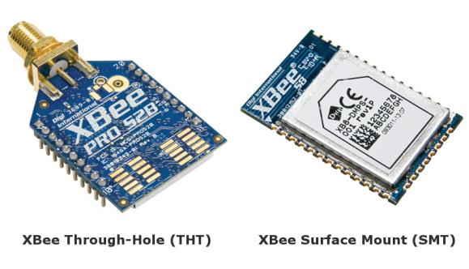
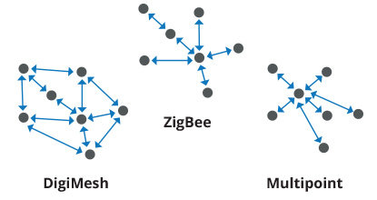
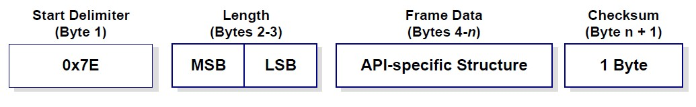
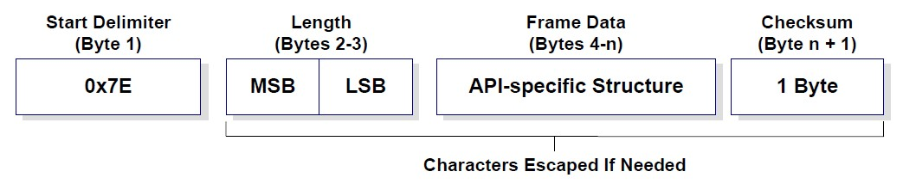

XBee terminology
================

This section covers basic XBee concepts and terminology. The XBee Python
Library manual refers to these concepts frequently, so it is important to
understand them.


RF modules
----------

A radio frequency (RF) module is a small electronic circuit used to transmit
and receive radio signals on different frequencies. Digi produces a wide variety
of RF modules to meet the requirements of almost any wireless solution, such as
long-range, low-cost, and low power modules.


XBee RF modules
---------------

XBee is the brand name of a family of RF modules produced by Digi International
Inc. XBee RF modules are modular products that make it easy and cost-effective
to deploy wireless technology. Multiple protocols and RF features are available,
giving customers enormous flexibility to choose the best technology for their
needs.

The XBee RF modules are available in three form factors: Through-Hole, Surface
Mount, and Micro, with different antenna options. Almost all modules are
available in the Through-Hole form factor and share the same footprint.




Radio firmware
--------------

Radio firmware is the program code stored in the radio module's persistent
memory that provides the control program for the device.

To update or change the firmware of the local XBee module or any other module
operating in the same network, use the mechanisms the XBee Python Library
includes. Other programs, such as XCTU, or the web interface of the XBee
Gateway, also allows you to update the firmware of your XBee nodes.


Radio communication protocols
-----------------------------

A radio communication protocol is a set of rules for data exchange between
radio devices. An XBee module supports a specific radio communication protocol
depending on the module and its radio firmware.

Following is the complete list of protocols supported by the XBee radio modules:

* IEEE 802.15.4
* Zigbee
* Zigbee Smart Energy
* DigiMesh (Digi proprietary)
* ZNet
* IEEE 802.11 (Wi-Fi)
* Point-to-multipoint (Digi proprietary)
* XSC (XStream compatibility)
* Cellular
* Wi-Fi



.. note::
   Not all XBee devices can run all these communication protocols. The
   combination of XBee hardware and radio firmware determines the protocol that
   an XBee can execute. Refer to the
   `XBee RF Family Comparison Matrix
   <https://www.digi.com/pdf/chart_xbee_rf_features.pdf>`_
   for more information about the available XBee RF modules and the protocols
   they support.


AT settings or commands
-----------------------

The firmware running in the XBee RF modules contains a group of settings and
commands that you can configure to change the behavior of the module or to
perform any related action. Depending on the protocol, the number of settings
and meanings vary, but all the XBee RF modules can be configured with AT
commands.

All the firmware settings or commands are identified with two ASCII characters
and some applications and documents refer to them as **AT settings** or
**AT commands**.

The configuration process of the AT settings varies depending on the operating
mode of the XBee RF module.

* **AT operating mode**. In this mode, you must put the module in a special mode
  called command mode, so it can receive AT commands. For more information about
  configuring XBee RF modules working in AT operating mode, see
  :ref:`atOperatingMode`.
* **API operating mode**. When working in this mode, entering in command mode
  will also allow the configuration of the local XBee. But to configure or
  execute AT commands in API mode, generate an AT command API frame containing
  the AT setting and the value of that setting, and send it to the XBee RF
  module. For more information about API mode see , see :ref:`apiOperatingMode`.


Radio module operating modes
----------------------------

The operating mode of an XBee radio module establishes the way a user, or any
microcontroller attached to the XBee, communicates with the module through the
Universal Asynchronous Receiver/Transmitter (UART) or serial interface.

Depending on the firmware and its configuration, the radio modules can work in
three different operating modes:

* Application Transparent (AT) operating mode
* API operating mode
* API escaped operating mode

In some cases, the operating mode of a radio module is established by the
firmware version and the firmware's ``AP`` setting. The module's firmware
version determines whether the operating mode is AT or API. The firmware's
``AP`` setting determines if the API mode is escaped (``AP=2``) or not
(``AP=1``). In other cases, the operating mode is only determined by the ``AP``
setting, which allows you to configure the mode to be AT (``AP=0``), API
(``AP=1``) or API escaped (``AP=2``).


.. _atOperatingMode:

Application Transparent (AT) operating mode
```````````````````````````````````````````

In Application Transparent (AT) or transparent operating mode, all data received
through the serial input is queued up for radio transmission and data received
wirelessly is sent to the serial output exactly as it is received. In fact,
communication in transparent mode yields the same result as if the two modules
were connected by a wire, but wireless communication makes that physical wire
unnecessary.

Some advantages of this mode:

* XBee in transparent mode act as a serial line replacement: what you send is
  exactly what the other module get.
* It is compatible with any device that speaks serial.
* It works very well when facilitating communication between two XBees.

Transparent mode has some limitations. For example:

* When working with several remote nodes, you must configure the destination
  before sending each message.
* It is not possible to identify the source of a received wireless message.
* To access the configuration of an XBee in transparent mode a special procedure
  for transitioning the module into :ref:`commandMode`.


.. _apiOperatingMode:

API operating mode
``````````````````

Application Programming Interface (API) operating mode is an alternative to AT
operating mode. API operating mode requires that communication with the module
through a structured interface; that is, data communicated in API frames.

The API specifies how commands, command responses, the module sends and
receives status messages using the serial interface. API operation mode enables
many operations, such as the following:

* Configure the XBee itself.
* Configure remote devices in the network.
* Manage data transmission to multiple destinations.
* Receive success/failure status of each transmitted RF packet.
* Identify the source address of each received packet.
* Advanced network management and diagnosis.
* Advanced features such as remote firmware update, ZDO, ZCL, etc.

Depending on the AP parameter value, the device can operate in one of two modes:
API (``AP=1``) or API escaped (``AP=2``) operating mode.


API escaped operating mode
``````````````````````````

API escaped operating mode (``AP=2``) works similarly to API mode. The only
difference is that when working in API escaped mode, some bytes of the API
frame specific data must be escaped.

Use API escaped operating mode to add reliability to the RF transmission, which
prevents conflicts with special characters such as the start-of-frame byte
(0x7E). Since 0x7E can only appear at the start of an API packet, if 0x7E is
received at any time, you can assume that a new packet has started regardless
of length. In API escaped mode, those special bytes are escaped.


Escape characters
'''''''''''''''''

When sending or receiving an API frame in API escaped mode, you must escape
(flag) specific data values so they do not interfere with the data frame
sequence. To escape a data byte, insert 0x7D and follow it with the byte being
escaped, XOR'd with 0x20.

The following data bytes must be escaped:

* 0x7E: Frame delimiter
* 0x7D: Escape
* 0x11: XON
* 0x13: XOFF


.. _commandMode:

Command mode
````````````

Command mode allows to get and set local XBee parameters and execute certain AT
commands.

To enter command mode, send the 3-character command sequence through the serial
interface of the radio module, usually ``+++``, within one second. Once the XBee
is operating in command mode, the module sends the reply ``OK``, the command
mode timer starts, and the data coming from the serial input is interpreted as
commands to set up the module.

The structure of an AT command follows this format:

``AT[ASCII command][Space (optional)][Parameter (optional)][Carriage return]``

Example:

``ATNI MyDevice\r``

If no valid AT commands are received within the command mode timeout, the radio
module automatically exits command mode. You can also exit command mode issuing
the ``CN`` command (Exit Command mode).


.. _apiFrames:

API frames
----------

An API frame is the structured data sent and received through the serial
interface of the radio module when it is configured in API or API escaped
operating modes. API frames are used to communicate with the module or with
other modules in the network.

An API frame has the following structure:



+---------------------+-----------------------------------------------------------------------------------------------------------------------------------------------------------------------------------------------------------+
| **Start delimiter** | This field is always 0x7E.                                                                                                                                                                                |
+---------------------+-----------------------------------------------------------------------------------------------------------------------------------------------------------------------------------------------------------+
| **Length**          | The length field has a two-byte value that specifies the number of bytes that are contained in the frame data field. It does not include the checksum field.                                              |
+---------------------+-----------------------------------------------------------------------------------------------------------------------------------------------------------------------------------------------------------+
| **Frame Data**      | The content of this field is composed by the API identifier and the API identifier specific data. Depending on the API identifier (also called API frame type), the content of the specific data changes. |
+---------------------+-----------------------------------------------------------------------------------------------------------------------------------------------------------------------------------------------------------+
| **Checksum**        | Byte containing the hash sum of the API frame bytes.                                                                                                                                                      |
+---------------------+-----------------------------------------------------------------------------------------------------------------------------------------------------------------------------------------------------------+

In API escaped mode, some bytes in the Length, Frame Data and Checksum fields
must be escaped.


